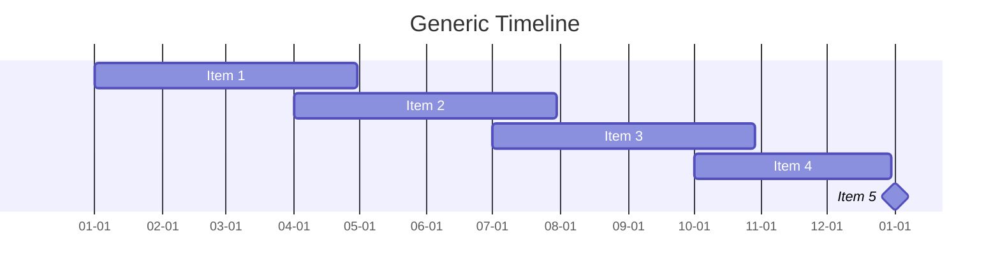

# ${1:$TM_FILENAME_BASE}

## Background

Lorem ipsum dolor sit amet, consectetur adipiscing elit. Nullam nec purus ac nunc ultricies tincidunt. Nullam nec purus ac nunc ultricies tincidunt. Nullam nec purus ac nunc ultricies tincidunt. Nullam nec purus ac nunc ultricies tincidunt.

## Timeline and Information

All timelines here are intentionally obfuscated to protect the company's privacy. Aside from the timeline, all other details such as software have already been covered in the first part of this series.



## Journey

Lorem ipsum dolor sit amet, consectetur adipiscing elit. Nullam nec purus ac nunc ultricies tincidunt. Nullam nec purus ac nunc ultricies tincidunt. Nullam nec purus ac nunc ultricies tincidunt. Nullam nec purus ac nunc ultricies tincidunt.

### Introduction

Lorem ipsum dolor sit amet, consectetur adipiscing elit. Nullam nec purus ac nunc ultricies tincidunt. Nullam nec purus ac nunc ultricies tincidunt. Nullam nec purus ac nunc ultricies tincidunt. Nullam nec purus ac nunc ultricies tincidunt.

### Section 1

**TL;DR**: Lorem ipsum dolor sit amet, consectetur adipiscing elit.

Lorem ipsum dolor sit amet, consectetur adipiscing elit. Nullam nec purus ac nunc ultricies tincidunt. Nullam nec purus ac nunc ultricies tincidunt. Nullam nec purus ac nunc ultricies tincidunt. Nullam nec purus ac nunc ultricies tincidunt.

### Section 2

**TL;DR**: Lorem ipsum dolor sit amet, consectetur adipiscing elit.

Lorem ipsum dolor sit amet, consectetur adipiscing elit. Nullam nec purus ac nunc ultricies tincidunt. Nullam nec purus ac nunc ultricies tincidunt. Nullam nec purus ac nunc ultricies tincidunt. Nullam nec purus ac nunc ultricies tincidunt.

### Section 3

**TL;DR**: Lorem ipsum dolor sit amet, consectetur adipiscing elit.

Lorem ipsum dolor sit amet, consectetur adipiscing elit. Nullam nec purus ac nunc ultricies tincidunt. Nullam nec purus ac nunc ultricies tincidunt. Nullam nec purus ac nunc ultricies tincidunt. Nullam nec purus ac nunc ultricies tincidunt.

## Conclusion

Lorem ipsum dolor sit amet, consectetur adipiscing elit. Nullam nec purus ac nunc ultricies tincidunt. Nullam nec purus ac nunc ultricies tincidunt. Nullam nec purus ac nunc ultricies tincidunt. Nullam nec purus ac nunc ultricies tincidunt.

## What's Next?

Lorem ipsum dolor sit amet, consectetur adipiscing elit. Nullam nec purus ac nunc ultricies tincidunt. Nullam nec purus ac nunc ultricies tincidunt. Nullam nec purus ac nunc ultricies tincidunt. Nullam nec purus ac nunc ultricies tincidunt.

```bash
nicholaschua@youread.me:~$ exit
logout
```
{: .nolineno }
{: file="nicholaschua@youread.me: ~" }

## References

1. [Lorem ipsum dolor][1]

[1]: https://www.example.com/

---
[Return to Top](#${FOAM_SLUG})