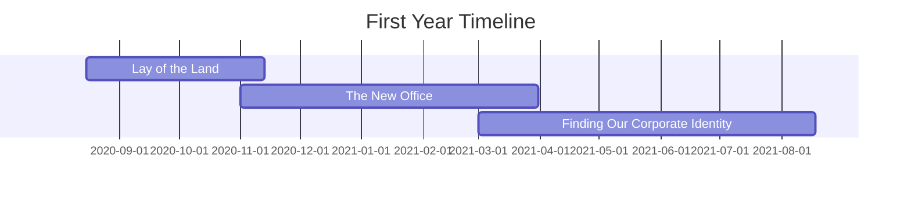

# Start-up Scale-up, a 36 Month Vision: Part 2/4

## Background

This will be the second in a four-part series where I reflect on the journey that I have taken as a **System Administrator at Biofourmis**, a digital health startup, from having almost nothing in IT systems, to achieving SOC II Type 2 compliance with a suite of top-class IT systems. The journey took 36 months, and I will be writing about my experience as a contributor. All views expressed are in a personal capacity and do not represent the views of any other person or organization.

## Timeline and Information

All timelines here are intentionally obfuscated to protect the company's privacy. Aside from the timeline, all other details such as software have already been covered in the [first part of this series]().



## Journey

**TL;DR**: I had to familiarize myself with the existing IT systems, and set up a business relationship with Apple for purchasing devices. I also interviewed my counterpart in the US, and was involved in the design and setup of a new office. Okta was introduced as the first step in a grand vision of IT systems that would be rolled out in the future.

### Introduction

I joined Biofourmis as a System Administrator in August 2020, enraptured with the promise of delivering a better future for healthcare through digital therapeutics and remote patient monitoring, led by the then-29 year old CEO who led a small team of 50 employees. In the Singapore office, I was the only IT person, with the closest help being a few timezones away. My first 'ticket' came around an hour after I stepped into the office for the first time, even before I had been given a laptop to work on.

I have to be honest that I felt helpdesk was beneath me, although I swallowed my pride and understood that this was one (and maybe the most important) hat I signed up to wear. It was this distaste in how little IT infrastructure we had that gave me the determination to change things for the better.

A few weeks into my tenure, I was surprised to learn that the company had closed their Series C funding round, a $100 million investment that would be used to accelerate the US expansion. This was an amazing sign of potential; I knew money would be spent, and I wanted to ensure that it was spent wisely.

### The Lay of the Land

**TL;DR**: A Mac-first approach demanded that I approach differently. I established a business relationship with Apple for purchasing devices. I interviewed my future boss. I negotiated a salary increase for taking on more responsibilities.

I had not expected initially that we were a Mac-first company. That necessitated a different approach from what I was used to, and so I dove deep into seeking out the best practices for managing Macs in an enterprise environment. I knew that we at least had XDR in place to protect our devices, a firewall that protected our network, and what I will refer to as **Product J**, a basic identity provider that also had limited MDM capabilities.

I learned that we did not have a prior relationship with Apple for purchasing devices, and so I set out to establish one. That was a very necessary first step that needed to be taken if an MDM solution was to take root in the company. The immediate benefit of this was the ability to purchase devices at a discount, which was one of the measurable impacts I managed to achieve early on in my tenure.

I also had to act as an interviewer for the person who would be my counterpart in the United States (and who would eventually become my manager). It was an interesting experience, as it was my first time being on the other side of the table. I had to make a quick decision on whether this person suited not just the role, but also aligned with the direction of desiring improvement in our IT systems. I am glad to say that we made the right choice, as this person has been instrumental in the growth of not just our IT systems, but also my personal growth.

One thing we often forget as System Administrators was that, although we managed machines, there were people behind those machines. My superior at the time, who was also the co-founder, was the person who reminded me of this, and I was grateful for that. He saw my potential and gave me the opportunity to represent the interests of IT and assist the office manager in building out the new office that was an extension of our existing office (and which would eventually become our only office), merely a few units down from where we were.

This was a project that, although not known to me at the time of my hiring, was one that I was excited to take on. I managed to negotiate with him for a permanent increase in my salary, as I was taking on more responsibilities than what was initially agreed upon. I used every trick in the book; it was one of the few times where I communicated with him in our native language (we spoke English the rest of the time). I was glad that he saw this higher value in me, and I vowed to reciprocate his trust in me.

### The New Office

**TL;DR**: I was involved in the design and setup of a new office, representing the interests of IT. I understood how employees worked and designed the office in a human-centric way. I understood the challenge of a cross-disciplinary project.

I did not do this alone, for I had the assistance of my counterparts in India and the US to guide me throughout this new office setup, along with the office manager whom I had already previously gotten along with well before the project.

We designed the new office in a human-centric way, with the IT infrastructure enabling employees to work in a place where they could feel comfortable and productive. A few highlights were the use of small, private rooms and nooks for employees to take calls, outfitting the office with new USB-C monitors that enabled employees to use their MacBooks with a single cable, and video-conferencing setups that were easy to use and reliable.

The new office was a resounding success, and I was proud to have been a part of it. In retrospect, it was a project that was a turning point in my career, as it was the first time I had taken on a project of this scale and importance. It was also the first time I had to manage a cross-disciplinary project, where we agreed that the human was the most important part of the project, and that everything we did was set up such that they could work in the best environment possible.

### Finding Our Corporate Identity

**TL;DR**: I was sold on a grand vision of what our IT systems could be, and the first step was to introduce Okta. We moved slowly and deliberately, allowing it to permeate the company culture. Applications began to join the Okta ecosystem, demonstrating Okta's convenience. All went well.

My counterpart in the US introduced me to a grand vision of what our IT systems could be (which aligned with my understanding of an ideal It systems optimized for Macs in our corporation) and the first step to realizing that vision was to introduce [Okta][1]. Although we had Product J in place, it was, at the time, not mature enough to handle the demands of being both an identity provider and an MDM solution.

Okta was the first half of the solution that we needed, and it was the solution that would become the single source of truth, and the cornerstone of our IT systems. Nothing was integrated with Okta at first, which was a good thing as it allowed us to roll out Okta in a wide scope to everyone without it impacting their work. We moved slowly and deliberately, allowing Okta to permeate the company's culture.

With a swift rollout and no major issues, we were able to move on with the tone set for the rest of the IT systems that we would roll out in the future. Applications began to join the Okta ecosystem, demonstrating the convenience that Okta yet had to offer to everyone.

In the US, my counterpart also began to set up their business relationship with Apple, which was a good sign that we were moving in the right direction.

## Conclusion

The first year at Biofourmis was a whirlwind of activity. I learned and accomplished a great deal in a short time and was eager to see what the future held. We laid the groundwork for our IT systems, setting the stage for achieving SOC II Type 2 compliance.

## What's Next?

This is the second of the series, and I hope that you have been intrigued by this story so far. The next post will detail the second year of my journey at Biofourmis, where the demands of life and work both grew, and I had to rise to the challenge. Stay tuned!

```bash
exit
```

## References

1. [Okta][1]

[1]: https://www.okta.com/

---

[Return to Top](#start-up-scale-up-a-36-month-vision-part-24)