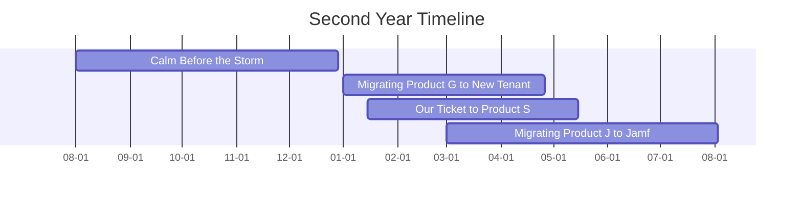

# Start-up Scale-up, a 36 Month Vision: Part 3/4

## Background

This will be the third in a four-part series where I reflect on the journey that I have taken as a **System Administrator at Biofourmis**, a digital health startup, from having almost nothing in IT systems, to achieving SOC II Type 2 compliance with a suite of top-class IT systems. The journey took 36 months, and I will be writing about my experience as a contributor. All views expressed are in a personal capacity and do not represent the views of any other person or organization.

## Timeline and Information

All timelines here are intentionally obfuscated to protect the company's privacy. Aside from the timeline, all other details such as software have already been covered in the [first part of this series](#technologies-used).



## Journey

**TL;DR**: Even as I juggled my studies and work, the second year at Biofourmis was a rapid period of growth for not just me, but also the company. We migrated from Product G to a new tenant, introduced Product S, and migrated from Product J to Jamf. The goodwill we earned was instrumental in the success of the next project.

### Introduction

Just before the start of the second year, I had received an offer from a university (Singapore Institute of Technology) to pursue a degree in Information Security. I am still there as of the time of writing. I initially lamented that I had to give up the dream of seeing this journey through to the end, but it was my team who convinced me that I could, and quite possibly should, do both. I am glad that I listened to them, as the knowledge and perspective I gained from my studies has been instrumental in the growth of our IT systems. I dedicated as much time as I could to my studies and the company's growth, and I am proud to say that I felt in control of both.

I had never thought of it at first, but I now had to pass the torch to my full-time successor. It was an interesting moment to consider succession planning, and I had to ensure that the knowledge I had gained was passed on to the next person. I was proud to say that person had exceeded my expectations, and I was glad to have seen my knowledge transferred to someone whom I could work with in the future.

With that out of the way, the second year was a rapid period of growth for not just me, but also the company. In April 2022, we had closed our Series D funding round, a $300 million investment that boosted our company to unicorn status. We were going to be a top player, and our IT systems had to play that part as well.

### Migration From Product G to New Tenant

**TL;DR**: We migrated from Product G to a new tenant, with signficant alterations to our timeline due to the vendor's reluctance. We were able to salvage the situation and complete the migration with minimal issues.

Before this period of rapid growth, we had been using Product G for our business productivity suite. Product G prided itself on introducing a 'abstraction layer' over an industry-standard productivity suite that made it easier for administrators to manage users and services. However, we saw that this also made it needlessly difficult or even impossible to make use of certain features. We also understood that, as long as there were no problems, we would be fine, as dealing with Product G's support was not a great experience. This may have made sense when the company had received its Series C funding, but we are on the cusp of the exciting Series D.

The talk of migrating away from our tenant had been going on for years, even before I had joined, although it was only in the second year that we had the resources and management's backing to do so. Product G's limitations also proved to be a stumbling block for other teams, such as being an obstacle to a planned ERP system implementation.

It was a painful pill to swallow, as this was just about the first system where a migration unilaterally affected everyone in the company. We had to plan and execute the migration with utmost care, not just to ensure that data remained intact, but also to further boost the IT team's legitimacy and goodwill with the rest of the company to ensure minimal resistance to the future changes we were planning.

Although we had planned meticulously, the vendor of Product G very much did not want to stick with our planned project timeline. We had to escalate the issue several times, and it took at least a day before the migration could fully complete because of that. Overall, however, we were able to complete the migration with minimal issues, and any that cropped up had been already planned for and resolved quickly.

Although the benefits of the migration was not apparent to most employees, the important thing was that this was a signficant step in taking control of our IT systems. That we were able to do so with minimal disruption to the company's operations was a testament to the hard work and dedication of the entire team, and I believe that the goodwill we earned was instrumental in the success of the next project.

### Our Ticket to Product S

**TL;DR**: We introduced Product S, a ticketing system that allowed us to track the issues that cropped up, measure the success of our IT systems, and the knowledge base would serve both employees and IT team members.

During the migration from Product G, we faced the issue of tracking the issues that cropped up. We had no formal way of doing so, and we had to rely on a mix of email and chat to track the issues that cropped up. This was not sustainable, and we had to find a solution that would allow us to track the issues that cropped up, and also to measure the success of our IT systems.

We had been looking at a ticketing system for a while, and Product S was another part of the grand vision of IT systems that we had been planning. Without a formal ticketing system in place, we could not accurately track the metrics that would measure the success of our IT systems, and our resources could not be used effectively.

The knowledge base would also play a dual role in serving as the IT team's knowledge base, ensuring that the knowledge previously passed down from person to person was now documented and accessible to all. This was a big step in ensuring that the IT team could continue to function even if a key member was unavailable. This resonated deeply with me, as I had been the one to ensure that the knowledge I had gained was passed on to my successor, and I was glad to see that the knowledge base served as a recognition of the importance of documentation.

The extra step of putting in a ticket was not something employees were used to, as they previously emailed, or in the case of the Singapore office, walked over to my desk and got it resolved in a reasonable timeframe. We understood this, and we had to leverage the goodwill we had earned from our previous projects to assure employees that this was a necessary step in ensuring that their issues were resolved in a timely manner.

The rollout of Product S was a resounding success, and I was proud to have been a part of it. Although my work on Product S had been limited due to my work arrangement, I was glad to see that Product S helped to streamline many processes that had previously been manual, and that employees were using it in earnest. I did my best to contribute to the knowledge base, making sure everyone would benefit.

### Migration from Product J to Jamf

**TL;DR**: The migration from Product J to Jamf was a success, exceeding our expectations. Rocketman Tech provided the necessary expertise to make this migration a success, and they were always around to make the necessary adjustments to the workflows. Jamf Connect added to the experience, ensuring that the single source of truth was seamlessly maintained.

The crowning achievement of the second year was the migration from Product J to Jamf. As in our [case study by Jamf][2], we had a diverse estate of Apple devices, with the Singapore office devices enrolled in Product J, but not the other offices. We also had a mix of different versions of macOS, with a rare few devices even running versions that were no longer officially supported. We needed a streamlined workflow that could transition all devices to Jamf, and we wanted to achieve it in a way that required no IT assistance, limited user interaction, and minimal downtime.

This tall order was beyond the capabilities of our team, so we were glad that Jamf connected us with [Rocketman Tech][3] to provide the necessary expertise to make this migration a success. We conveyed our requirements and our current situation, and they worked with us to formulate a plan, along with all the necessary scripts and workflows to make the migration a success.

Even as we faced unforeseen issues, Rocketman was always around to make the necessary adjustments to the workflows. They also accommodated our requests to make accessibility changes to the workflows, and this gave us the confidence that their vision was aligned with ours. With their white-glove service, we were able to see at least 600 happy employees and devices transitioned to Jamf, exceeding our expectations.

Jamf Connect was also a great addition to our identity mangement stack. When a user logs in to their Mac, the workflow is streamlined such that they are shown a custom login screen that allows them to authenticate with their Okta credentials. This was a great addition to our security stack, as it ensured that the single source of truth was maintained, and this could even be extended to the new hire onboarding experience.

As we got used to playing with our new toys, Rocketman remained hard at work in the background, simultaneously resolving the small issues that cropped up, as well as preparing us for the apex of our promise to the users: Zero-Touch Deployment.

## Conclusion

My second year at Biofourmis was a tumultuous time marked by rapid growth and change. We had to act less like a startup and more like an established player in the digital health field, and our systems needed to reflect that. The migration from Product G to a new tenant, the introduction of Product S, and the migration from Product J to Jamf were all steps in the right direction, and I am proud to have been a part of it, even as I juggled my studies and work.

## What's Next?

This is the third of the series, and I hope that you have been intrigued by this story so far. The next post will detail the third year of my journey at Biofourmis, where we experienced how Zero-Touch Deployment was functionally magic, as well as completing our suite of systems. Stay tuned!

```bash
exit
```

## References

1. [Biofourmis and Jamf deliver best-in-class security and regulatory compliance][1]
2. [Jamf Pro][2]
3. [Jamf Connect][3]
4. [Rocketman Tech][4]

[1]: https://www.jamf.com/resources/case-studies/biofourmis-and-jamf-deliver-best-in-class-security-and-regulatory-compliance/
[2]: https://www.jamf.com/products/jamf-pro/
[3]: https://www.jamf.com/products/jamf-connect/
[4]: https://www.rocketman.tech/

---

[Return to Top](#start-up-scale-up-a-36-month-vision-part-34)