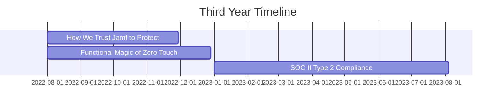

# Start-up Scale-up, a 36 Month Vision: Part 4/4

## Background

This will be the last in a four-part series where I reflect on the journey that I have taken as a **System Administrator at Biofourmis**, a digital health startup, from having almost nothing in IT systems, to achieving SOC II Type 2 compliance with a suite of top-class IT systems. The journey took 36 months, and I will be writing about my experience as a contributor. All views expressed are in a personal capacity and do not represent the views of any other person or organization.

## Timeline and Information

All timelines here are intentionally obfuscated to protect the company's privacy. Aside from the timeline, all other details such as software have already been covered in the [first part of this series]().



## Journey

**TL;DR**: We trusted Jamf to protect our devices and identity, and we were not disappointed. We also achieved SOC II Type 2 compliance, a great achievement for us, as it was a testament to the hard work that we had put in over the past three years.

### Introduction

Shortly before Jamf had been fully rolled out, I had to return to university. I believed we were in good hands, as the IT team had been following the plans we had laid out, and there were few issues that were resolved by [Rocketman Tech][3], our MSP, quickly.

Deployment began on Jamf Protect and Jamf Trust pretty soon, while we were still waiting on the time to execute on our Zero-Touch Deployment plans. They were a small part of the grand vision of IT systems that we had been planning, but they were no less important in ensuring that our devices and workflows were secure.

Halfway through the year, my full-time successor had left the company, and I had to step in to train a new full-time successor. This was a challenge, as I did not have the luxury of time to conduct as comprehensive a training as I would have liked. Despite that, however, I was confident that the new successor would be able to take over the reins, as the suite of systems had become so much more mature than the state they were in when I had first joined, or when their predecessor had first joined.

### How We Trust Jamf to Protect

**TL;DR:** We deployed Jamf Protect and Jamf Trust, the final pieces of the puzzle that we needed to complete our suite of systems. Both function in tandem, with Jamf Protect providing advanced threat protection for macOS, and Jamf Trust providing Zero-Trust Network Access (ZTNA).

[Jamf Protect][4] and [Jamf Trust][5] were the next steps in our journey. Jamf Protect was an endpoint security solution that provided advanced threat protection for macOS, while Jamf Connect was a solution that streamlined Mac authentication and identity management. These were the final pieces of the puzzle that we needed to complete our suite of systems, and I was glad that we had managed to get them in place.

Though we already had an XDR and SIEM solution in place, Jamf Protect was a great addition to our security stack. We also particularly liked the ease of use of Jamf Protect compared to our existing XDR solution, and we were planning to decide if decommissioning the existing solution was the right call in the years ahead.

Meanwhile, Jamf Trust was a great addition to our identity management stack. With Biofourmis's largest office being in the US, and employees being geographically distributed across the country, it was important that we had Zero-Trust Network Access (ZTNA) in place. Jamf Trust was a great solution for this, as it allowed us to grant the appropriate levels of access based on the risk assessed.

### The Functional Magic of Zero-Touch Deployment

**TL;DR:** Zero-Touch Deployment was a process that was automated from start to finish, with the devices being shipped directly from the manufacturer to the employee, and the devices being enrolled in our MDM solution as soon as the devices were connected to the internet. The user was allowed to register their identity and complete the setup process together, and this was a process that was so seamless that it was almost invisible.

As someone who has experienced the magic of Zero-Touch Deployment, I would love to share how this magic with you.

As stated in the [case study by Jamf][1], Zero-Touch Deployment is a workflow that allows for the seamless deployment of devices to employees, without the need for manual intervention. This was especially important in a remote-first world, where employees would not be expected to be physically present. It was also important to ensure that the devices were secure from the start of the supply chain, so that even if our devices were intercepted in transit, they could not be compromised.

The workflow of Zero-Touch Deployment was functionally magic. It was a process that was automated from start to finish, with the devices being shipped directly from the manufacturer to the employee, and the devices being enrolled in our MDM solution as soon as the devices were connected to the internet. This was a process that was invisible to the employee, needed no IT assistance, required limited user interaction, and the setup process could be completed once the Jamf Connect login screen appeared for them to set up their device and identity for the first time.

This process was, in my opinion, the epitome of our success, reducing the time taken to deploy devices from hours to mere minutes. This was in addition to the security benefits and improved user experience. It was a process that was so seamless that it was almost invisible, and it was a process that I was proud to have been a part of.

### The SOC II Type 2 Compliance Journey

**TL;DR:** With the completion of this suite of systems, we were well on our way to achieving SOC II Type 2 compliance. This was only possible with the hard work that we had put in over the past three years, and the success of our IT systems was a testament to that.

With the completion of this suite of systems, we were well on our way to achieving SOC II Type 2 compliance. We had already achieved SOC II Type 1 compliance, and we were confident that we would be able to achieve SOC II Type 2 compliance in the years ahead. We had already been tracking metrics to measure the success of our IT systems, and we were confident that we would be able to meet the stringent requirements of the SOC II Type 2 audit.

As far as I know, the audit portion relating to our IT systems was a success, and we were able to achieve SOC II Type 2 compliance. This was a great achievement for us, as it was a testament to the hard work that we had put in over the past three years. It was also a great achievement for me personally, as it was a testament to the hard work that we had put in over the past three years.

## Conclusion

All in all, the journey that I had taken as a System Administrator at Biofourmis was a remarkable one. I had the opportunity to learn and grow in ways that I had never imagined, and I would say this was a journey that I would gladly take again if given the chance. I had the opportunity to work with a team of talented individuals, each bringing their unique skills and perspectives to the table, and I was grateful for the chance to learn from them. Although I am no longer with the company, I am proud of the work that we had done, and I am confident that our suite of IT systems will continue to serve the company well in the years ahead.

## What's Next?

This is the last of the series, and I hope that you have enjoyed this sharing of my experience greatly. I will be moving on to other topics and taking a slower pace in writing - the plan is to publish once every 2 weeks - so do look out for my next post! It will talk about my journey with the CISSP certification, and how I managed to pass it on the first try.

```bash
exit
```

## References

1. [Biofourmis and Jamf deliver best-in-class security and regulatory compliance][1]
2. [Jamf Pro][2]
3. [Rocketman Tech][3]
4. [Jamf Protect][4]
5. [Jamf Trust][5]

[1]: https://www.jamf.com/resources/case-studies/biofourmis-and-jamf-deliver-best-in-class-security-and-regulatory-compliance/
[2]: https://www.jamf.com/products/jamf-pro/
[3]: https://www.rocketman.tech/
[4]: https://www.jamf.com/products/jamf-protect/
[5]: https://www.jamf.com/products/jamf-trust/

---

[Return to Top](#start-up-scale-up-a-36-month-vision-part-44)