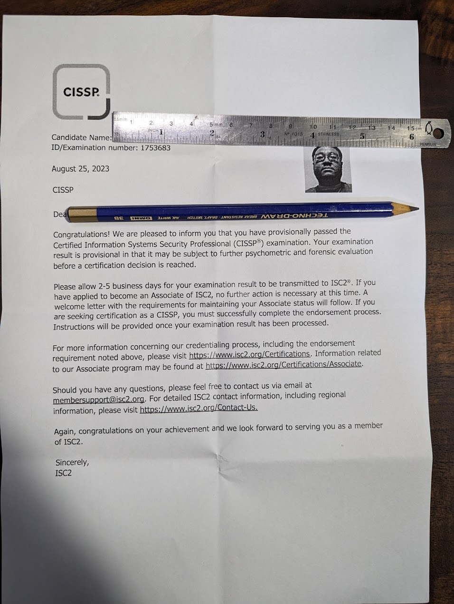

# Passing the CISSP Exam on My First Try

## Introduction

##### Disclaimer

The CISSP exam I took was the version between 1 May 2021 and 14 April 2024, before the latest refresh on 15 April 2024. The content of the exam is still extremely similar to the current version, and the discussion here is still relevant to the current exam. However, any study materials I used will likely have a new version published, and I am linking to the latest version at the time of writing.

### The CISSP Certification

The [Certified Information Systems Security Professional (CISSP)][1] Certification is a globally recognized certification in the field of information security. It is offered by the International Information System Security Certification Consortium, or ISC2. The CISSP certification is considered the gold standard in the industry and is highly sought after by professionals in the field of cybersecurity.

To become certified, one must pass the comprehensive CISSP exam which covers 8 diverse domains of information security. One must also have at least 5 years (4 with a degree or relevant certification) of relevant work experience in at least 2 of the 8 domains. Without the required work experience, one can still take the exam and become an Associate of ISC2 until the experience requirement is met.

### Why I Took the CISSP Exam

I decided to take the CISSP exam in August 2023 to further my career in the field of cybersecurity. In my university, a requirement to graduate is to have at least one professional certification. I chose the CISSP certification because I felt that my work experience gave me an edge over my classmates who were also considering the exam, and quite frankly, I wanted to challenge myself.

Even though I did not yet have the required years of work experience to meet the experience requirements, I realized that I would attain the required experience around the same time as my graduation. This would give me an undeniable advantage over my peers in the job market.

## Study Materials

**TL;DR**:

| Resource | Comments | Rating |
| --- | --- | --- |
| [Official CISSP Study Guide][2] (OSG) | Extremely detailed but extremely boring to read. Still the best resource in terms of knowledge though. | 4/5 |
| [Destination CISSP: A Concise Guide][3] | Extremely concise, illustrated version of the OSG. Covers 80% of the OSG in only ~40% of the pages. A must-read. | 5/5 |
| [Pete Zerger's CISSP Exam Cram][4] | Even more condensed audiovisual resource targeting key confusion points. A must-watch to recap. | 4/5 |
| [Mike Chapple's CISSP Cert Prep][5] | Supplements the OSG but acts more like an overview rather than going into detail. Can be skipped if lacking time. | 3/5 |
| [LearnZapp CISSP Exam Prep App][6] | Realistic exam-styled questions that accelerate your learning process. A must-use to get used to the exam. | 5/5 |
| [How To Think Like A Manager for the CISSP Exam][7] | Challenges your thought process and gets you used to thinking the way CISSP wants you to. Very helpful. | 4/5 |

At first, I studied very casually, beginning with the [Official CISSP Study Guide][2] by ISC2. This was a hefty 1250-page read, and I found my progress moving at a snail's pace. Seeking a shortcut, I turned to [Destination CISSP: A Concise Guide][3], which was a much more manageable 514-page read.

The difference in presentation and conciseness was like night and day, and I found myself making much more progress with this book. I still referred back to the OSG for more in-depth explanations of certain topics, and eventually finished reading it in its entirety after 4 months.

I explored other resources such as [Pete Zerger's CISSP Exam Cram][4] on YouTube, which was a great resource for summarizing and understanding the concepts in a audiovisual format. I also used [Mike Chapple's CISSP Cert Prep][5] on LinkedIn Learning, which was a great supplement to the OSG, though I felt it could not stand alone as a study resource.

Eventually the time came to apply what I've learned, and I made use of the [LearnZapp CISSP Exam Prep App][6] to test my knowledge. The app was a great resource for practicing exam questions and identifying areas where I needed to improve. I found it extremely realistic, staying true to the format (not the difficulty) of the actual exam.

Finally, I read [How To Think Like A Manager for the CISSP Exam][7], which was a great resource for understanding the managerial perspective of the CISSP exam. This book helped me to think about the exam questions from a different angle and understand the mindset of a security manager.

Other resources I used but did not complete (and thus will not rate) include:
- [ThorTeaches CISSP Practice Tests][8]
- [Gwen Bettwy CISSP Mock Exam][9]
- [Sunflower CISSP Summary][10]
- [Eleventh Hour CISSP][11]

## Study Plan

I started studying for the CISSP exam casually in March 2023, taking about half an hour a day to read through the study materials. Over time, I ramped up my study time to 1-2 hours a day in April, and then to 3-4 hours a day from May onwards. I kept a consistent study schedule, studying practically every day, even on weekends, never skipping a day (only reducing the study time on some days).

I took opportunities to study whenever I could, such as during my commute or meal breaks. This continuous exposure to the material helped me to reinforce my understanding of the concepts and keep the information fresh in my mind.

Even if I did not get a chance to sneak in some study time during the day, I would have consistent time set aside for studying at night. I would say that this consistency was where I gained the most benefit from my study plan.

## Exam Day

#### The Exam

At 0745 hours, I was ushered into the exam room, where I was checked for any prohibited items and briefed on the exam rules. I was then seated at a relatively spartan desk with a computer, a piece of paper, a pen, and a pair of ear defenders. The only thing I could think about was how uncomfortable the chair was, how distracting my heartbeat sounded when the ear defenders cut out all the ambient noise, and how the cold air conditioning would make me need to use the restroom later. Funnily enough, I never needed to take a break during the exam.

240 minutes, 125-175 questions. The exam felt like a rollercoaster of emotion, with the first quarter of questions being a linear progression of difficulty. The questions after that tended to cluster around being either extremely difficult or reasonable, with no predictable progression. There was also a pocket of about 10 questions which were extremely easy nearer the end of the exam.

As I completed the 125th question, I was surprised to see the exam end. It was a harrowing 172 minutes. I had expected to see a full 175 questions, so I took this as either a good sign that I did well, or a bad sign that I was irredeemably bad at this. I leaned towards the latter, as the exam asked a lot about things I had never seen or thought of before, and I honestly had no choice but to guess.

#### The Result

{: width="602" height="800" }
_The End Result_

## Exam Tips

When studying, **consistency is key**. I found studying every day, even if only for a limited period of time, helped me retain information better. While I never took breaks from studying, I would still recommend **taking breaks if you feel overwhelmed or burnt out**. Your health is more important than a piece of paper.

One important tip I picked up was to **get a good night's sleep two days before the exam**, as it would be difficult to sleep the night before. I followed this advice and still do, even for other important events in life.

Remember the CISSP exam wants you to think like a manager or a risk advisor, not a technician. **Think about the big picture/business impact** of the decisions you make. The technical way is not always the best way in the CISSP exam, even if it is the most common way in the real world.

Do not find the right answer, find the **best answer**. You will often see that all choices are technically correct, but one is the best answer. **Train yourself to find wrong answers**, as elimination is the most powerful tool to find the best answer. Understanding why an answer is wrong is even more important than understanding why an answer is right.

**Look at the answers before looking at the question**. This helps focus on looking for comparative keywords such as "least", "most likely", "most important". **Keywords provide context to the question** and help you eliminate the wrong answers.

For a 240 minute exam with up to 175 questions, my strategy was to **allocate 75 seconds per question**. I also decided to **move on with my current answer if I spent more than 90 seconds** on a question, as I would likely not change my answer even if I spent more time on it. **Take a break if you need to**, but account for it in your time management.

Finally, **stay calm and focused**. This exam is designed to make you question your life decisions from the point you started considering even taking the CISSP. This exam is as much a test of your knowledge as it is a **test of your mental fortitude and emotional control**. This is not a marathon, but a triathlon. Prepare yourself accordingly.

If you fail the exam, the [WannaBeACISSP Course][12] is half price for anyone who fails, and free for anyone who fails twice. The CISSP Peace of Mind Guarantee for an extra 199 USD is also an option if you are not confident, as it gives you two tries at the exam.

## Conclusion

As I look back on my CISSP journey, I realize that it was not about passing the exam, but about the knowledge and skills I gained along the way. As someone with a technical background, I realized that there is a big picture to consider as well: security is not just about implementing technical controls, but also about addressing human behavior, business processes, and organizational culture. If I want to be successful in the field of cybersecurity, I need to be able to think like a manager and understand the broader implications of my decisions. I hope this retrospective of my CISSP journey will inspire you to take on your certification journey as well.

## What's Next?

My next article will be a two part series, focusing on my homelab setup with a Raspberry Pi 4B. The first speaks about my desire for and implementation of a private DNS, and the second about my VPN and media server needs. Stay tuned!

```bash
nicholaschua@youread.me:~$ exit
logout
```
{: .nolineno }
{: file="nicholaschua@youread.me: ~" }

## References

1. [Certified Information Systems Security Professional][1]
2. [ISC2 CISSP Certified Information Systems Security Professional Official Study Guide, 10th Edition][2]
3. [Destination CISSP: A Concise Guide][3]
4. [Pete Zerger's CISSP Exam Cram][4]
5. [Mike Chapple's CISSP Cert Prep][3]
6. [LearnZapp CISSP Exam Prep App][4]
7. [How To Think Like A Manager for the CISSP Exam][6]
8. [ThorTeaches CISSP Practice Tests][8]
9. [Gwen Bettwy CISSP Mock Exam][9]
10. [Sunflower CISSP][10]
11. [Eleventh Hour CISSP][11]
12. [WannaBeACISSP Course][12]

[1]: <https://isc2.org/Certifications/cissp>
[2]: <https://www.google.com/books/edition/ISC2_CISSP_Certified_Information_Systems/k2Wo0AEACAAJ>
[3]: <https://books.google.com./books/about/Destination_CISSP.html?id=iniOzwEACAAJ&source=kp_book_description>
[4]: <https://www.youtube.com/watch?v=_nyZhYnCNLA>
[5]: <https://www.linkedin.com/learning/isc2-certified-information-systems-security-professional-cissp-2024-cert-prep>
[6]: <https://www.learnzapp.com/apps/cissp/>
[7]: <https://books.google.com/books/about/How_To_Think_Like_A_Manager_for_the_CISS.html?id=xx6_zQEACAAJ&source=kp_book_description>
[8]: <https://www.udemy.com/course/cissp-domain1-2/>
[9]: <https://www.udemy.com/course/cissp-mock-exams-master-all-8-domains/>
[10]: <https://www.sunflower-cissp.com/>
[11]: <https://www.google.com/books/edition/Eleventh_Hour_CISSP/WZo5DAAAQBAJ>
[12]: <https://www.wannabeasscp.com/wannabeacissp>

---
[Return to Top](#passing-the-cissp-exam-on-my-first-try)