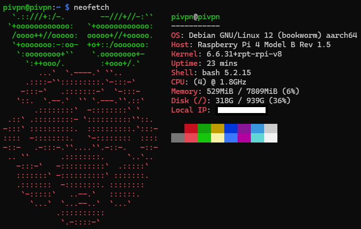

# Pi 4B Starter Homelab Part 2/2: Media Server

## Problem Statement

I realized that my Raspberry Pi 4B was underutilized with just the DNS services running. I wanted to expand its capabilities by setting up a media server to host and stream music and books. I also wanted to host a private VPN service to allow remote access to my home network securely. This would allow me to access my media library and other services from anywhere in the world.

## Background

I leveraged the existing Raspberry Pi 4B setup to setup a media server along with a VPN server. The media server would make use of the compute resources of my Raspberry Pi better to stream music and books. The VPN server would allow me to ensure this setup remains secure and private, even when accessed remotely. In combination with the Dynamic DNS I already set up, I would be able to access my home network anytime, anywhere.

## Solution

##### Technologies Used

- [Raspberry Pi 4 Model B][1]: A palm-sized low-power computer that can be used for various software and hardware projects and as a server
- [Jellyfin][2]: An open-source media server that allows you to host and stream your own media library
- [Samba][3]: An open-source implementation of the SMB/CIFS networking protocol that allows file sharing between Windows and Linux systems
- [pivpn][4]: A simple OpenVPN and WireGuard server installer for Raspberry Pi
- [WireGuard][5]: A modern VPN protocol that is faster and more secure than traditional VPN protocols

## Learning Objectives

The key learning objectives of this project include:

- [x] Install and configure Jellyfin to host and stream a media library
- [x] Install and configure Samba as a file server for easy file sharing
- [x] Install and configure pivpn to set up a secure and private VPN server
- [x] Understand the basics of WireGuard and how it suits the needs of a VPN server
- [x] Understand the basics of SMB/CIFS and how file sharing works between Windows and Linux systems

## Steps Taken

##### Research

1. I researched the technologies I would be using, particularly Jellyfin and WireGuard, to understand how they work and how to set them up.
2. I familiarized myself with the basics of WireGuard, and how it stands out from other VPN protocols like OpenVPN or IPsec. In particular, I focused on its cryptographic design.
3. I also familiarized myself on file sharing protocols like SMB/CIFS and how to set up a Samba server on the Raspberry Pi, as an easy means to populate the media server with content.

##### Setting up Jellyfin

Credits to [PiMyLifeUp: Installing Jellyfin to the Raspberry Pi][6] for the detailed steps on setting up Jellyfin on the Raspberry Pi.

1. I installed several necessary packages to support HTTPS repositories, as Jellyfin's repository uses HTTPS.

    ```bash
    sudo apt install apt-transport-https lsb-release
    ```

2. I downloaded the GPG signing key for Jellyfin and imported it.

    ```bash
    curl https://repo.jellyfin.org/debian/jellyfin_team.gpg.key | gpg --dearmor | sudo tee /usr/share/keyrings/jellyfin-archive-keyring.gpg >/dev/null
    ```

3. I added the repository configuration to my Raspberry Pi.

    ```bash
    echo "deb [signed-by=/usr/share/keyrings/jellyfin-archive-keyring.gpg arch=$( dpkg --print-architecture )] https://repo.jellyfin.org/debian $( lsb_release -c -s ) main" | sudo tee /etc/apt/sources.list.d/jellyfin.list
    ```

4. I updated the package list and installed Jellyfin.

    ```bash
    sudo apt update
    sudo apt install jellyfin
    ```

5. I created the necessary directories for the media server. I added some test files to them for the next steps.

    ```bash
    sudo mkdir -p /library/music
    sudo mkdir -p /library/books
    ```

6. I accessed the Jellyfin web interface by navigating to `http://<ip-address>:8096` on my browser (replace `<ip-address>` with the IP address of the Pi).

7. I went through the Jellyfin setup wizard to configure the media library and other settings. I added the `/library/music` and `/library/books` directories as media libraries.

8. I logged in to the Jellyfin dashboard and tested streaming a music file and a book file to ensure the media server was working correctly.

##### Setting up Samba

Once again, credits to [PiMyLifeUp: How to Setup a Raspberry Pi Samba Server][7] for the detailed steps on setting up Samba on the Raspberry Pi.

1. I installed the Samba package on the Raspberry Pi.

    ```bash
    sudo apt install samba samba-common-bin
    ```

2. I modified the Samba configuration file at `/etc/samba/smb.conf` to add the media directories and set up user permissions.

    ```plaintext
    [music]
    path = /library/music
    read only = no
    writeable = yes
    browseable = yes
    valid users = pivpn

    [books]
    path = /library/books
    read only = no
    writeable = yes
    browseable = yes
    valid users = pivpn
    ```
    {: file="/etc/samba/smb.conf" }

3. I created a Samba user to allow connections to the shared network drive.

    ```bash
    sudo smbpasswd -a pivpn
    sudo systemctl restart smbd
    ```

4. I accessed the shared network drive from a Windows machine by navigating to `\\<ip-address>` in File Explorer. I logged in with the Samba user credentials and tested copying files to and from the shared directories.

##### Setting up pivpn

1. I installed pivpn on the Raspberry Pi.

    ```bash
    curl -L https://install.pivpn.io | bash
    ```

2. I followed the pivpn setup wizard to configure the VPN server. I chose WireGuard as the VPN protocol, used the Pi-hole as the DNS server, and used my Dynamic DNS hostname as the VPN server address on port 51820 (in the scheme `<dynamic-dns-ip>:51820`).

3. I generated a client configuration for my phone to connect to the VPN server. I then generated a QR code for easy configuration on the phone.

    ```bash
    pivpn add
    pivpn -qr <client-name>
    ```

4. I installed the WireGuard app on my phone and scanned the QR code to configure the VPN connection. I tested the VPN connection on my hotspot to ensure it was working correctly.

## Conclusion

With the media server and VPN server set up, I am able to access my media library from anywhere in the world securely. The Raspberry Pi 4B is now being used to its full potential, serving as media server, file server, and VPN server, in addition to previous tasks. This setup allows me to stream music and books, access files remotely, and ensure my connection is secure and private. I am pleased with the expanded capabilities of my Raspberry Pi and look forward to expanding my homelab further.

{: width="734" height="466" }
_pivpn completed_

## What's Next?

A picture speaks a thousand words. To those who know what these two logos represent, the next post will be a treat. Stay tuned!

{: width="417" height="711" }
_two logos, one system_

```bash
nicholaschua@youread.me:~$ exit
logout
```
{: .nolineno }
{: file="nicholaschua@youread.me: ~" }

## References

1. [Raspberry Pi 4B][1]
2. [Jellyfin][2]
3. [Samba][3]
4. [pivpn][4]
5. [WireGuard][5]
6. [PiMyLifeUp: Installing Jellyfin to the Raspberry Pi][6]
7. [PiMyLifeUp: How to Setup a Raspberry Pi Samba Server][7]
8. [Installing pivpn][8]

[1]: https://www.raspberrypi.com/products/raspberry-pi-4-model-b/
[2]: https://jellyfin.org/
[3]: https://www.samba.org/
[4]: https://github.com/pivpn/pivpn
[5]: https://www.wireguard.com/
[6]: https://pimylifeup.com/raspberry-pi-jellyfin/
[7]: https://pimylifeup.com/raspberry-pi-samba/
[8]: https://docs.pivpn.io/install/

---
[Return to Top](#pi-4b-starter-homelab-part-22-media-server)