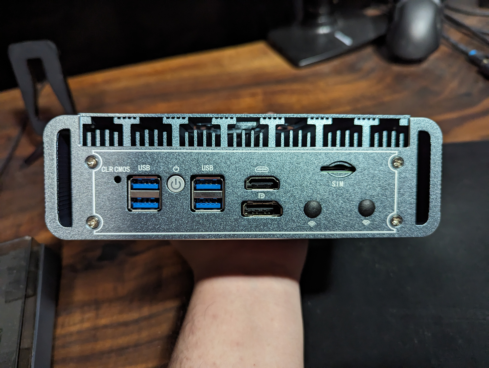
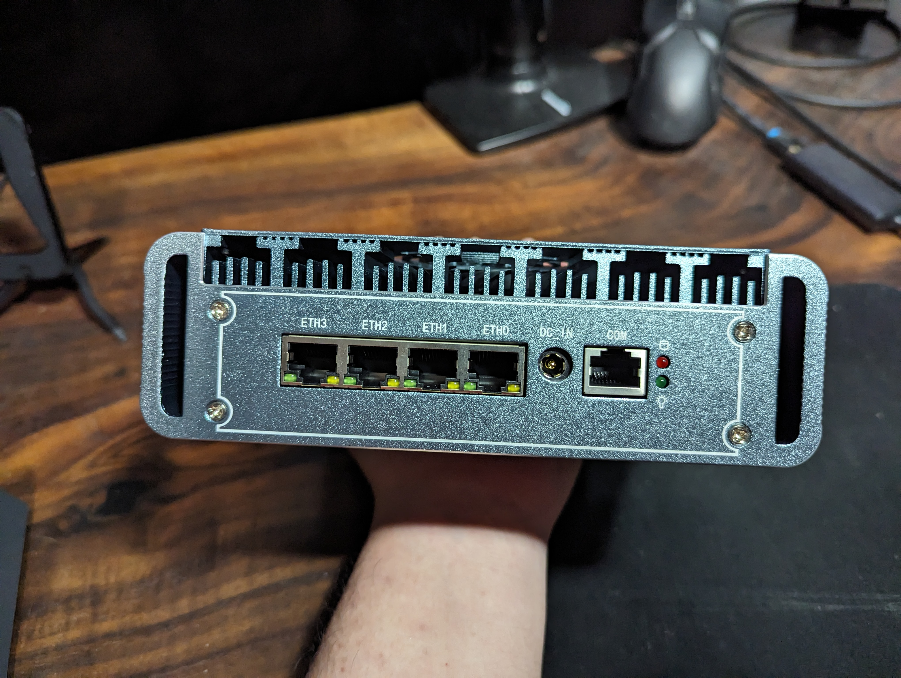
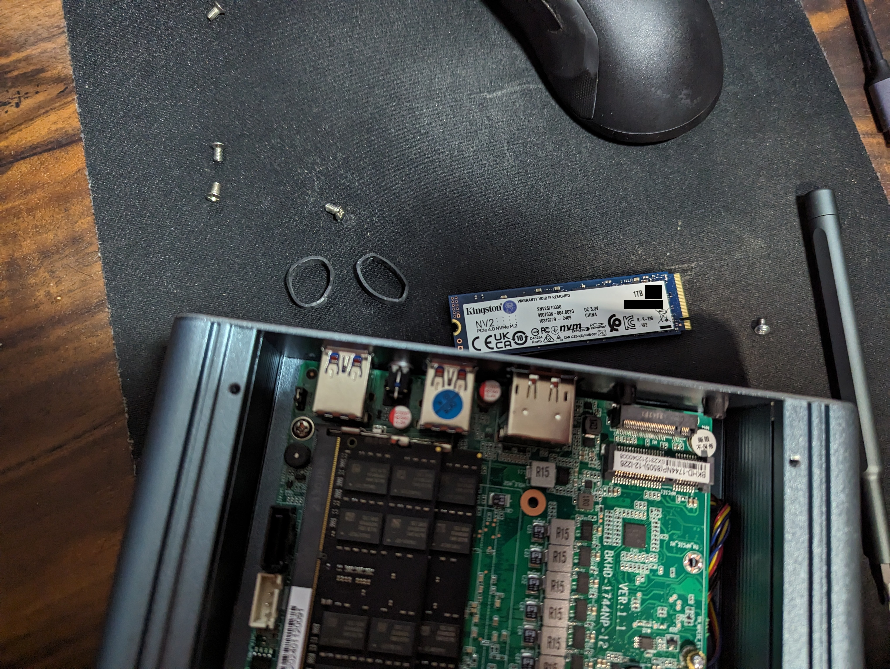
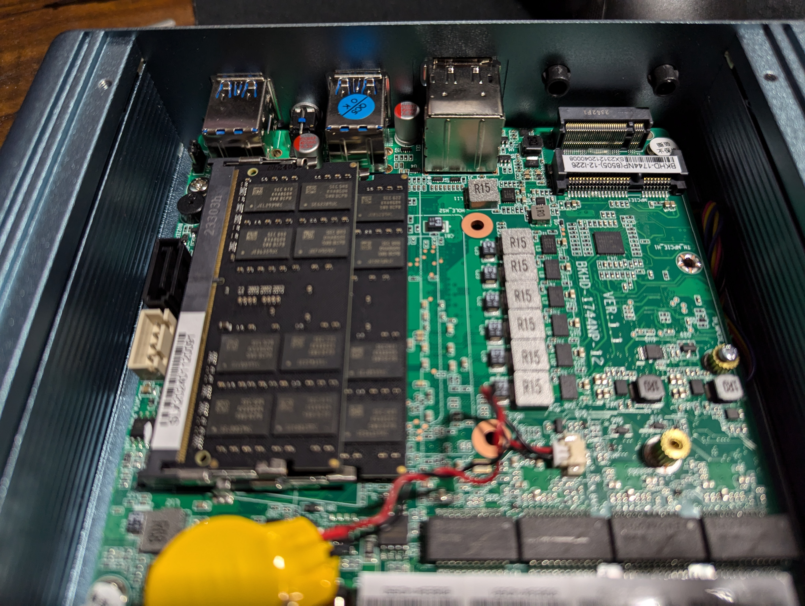

# OPNsense Software Router

#### Disclaimer

As made clear in my [About]() page, I do not do affiliate marketing or advertising. All products reviewed are purchased by me and all opinions are my own. I hate to see biased reviews as much as you do.

## Introduction

About a month ago, I decided to build a software router with OPNsense. I had been using an Asus router for the past year and wanted to experiment with a more flexible solution that gave me an opportunity to learn more. This post is a review of my experience with the hardware I purchased.

## Product Overview

I purchased [this router][1] from AliExpress for $387.29 SGD. I chose the Pentium Gold 8505 CPU with 32GB of RAM and 1TB of storage. Though it would have been better value if I had bought the RAM and storage separately, I was curious about what hardware would be provided. The router came pre-installed with Windows 11 Pro, but I wiped it and installed Proxmox VE as I planned to run OPNsense as a virtual machine, alongside other services.

The build quality of the router is excellent, with a full metal chassis and a relatively silent fan. There were also large vents all around to ensure good airflow. It also came with a large 12V 10A power supply from Delta Electronics. But what is important is the 4 2.5GbE ports, which I planned to fully occupy.

{: width="1594" height="1200" }
_Front of Router_

{: width="1594" height="1200" }
_Back of Router_

Taking a look inside, we see a well-organized layout with the RAM and storage easily accessible. The router also came with a SATA cable (not pictured) for additional storage. There is also a mini-PCIe slot which can be used for an expansion card, though it will remain unused for me.

{: width="1594" height="1200" }
_The Innards_

{: width="1594" height="1200" }
_The motherboard_

#### Network Ports

The router comes with 4x 2.5Gbe Intel i226V ports. I planned to use all 4 ports, with one for direct access to the Proxmox host, one for the OPNsense WAN, one for the OPNsense LAN, and one for loopback (as I passed through the WAN and LAN to the OPNsense VM). I am well aware of some issues faced by others with the i225V and i226V NICs, but I have not faced any issues so far.

#### Windows 11 Pro

I was pleasantly surprised to find an activated copy of Windows 11 Pro pre-installed. I did not plan to use it, but it was a nice touch. I added the product key to my Microsoft account before wiping the drive, and it is now currently in use within a Windows VM on the Proxmox host.

#### Cooling

I was initially concerned about the noise of the included fan, but I was able to find a silent mode in the BIOS which made the fan noise bearable under load, and inactive when idle. The metal chassis with venting all around also helped with cooling, and the router has been running relatively cool, even being passively cooled.

## Specifications

| ‎ | Name |
| --- | --- |
| CPU | Pentium Gold 8505 |
| RAM | 2x 16GB DDR4 |
| Storage | 1x 1TB M.2 2280 PCIe 3.0x4 |
| OS | Windows 11 Pro |
| Display | 1x HDMI + 1x DP |
| Ethernet Ports | 4x Intel i226V 2.5G |
| USB Ports | 2x USB 3.1 Gen 1 + 2x USB 2.0 |
| Expansion | 1x mini-PCIe |
| DC Input | 12V 6A |
| Weight | 550 grams |
| Dimensions | 178mm L x 122mm W x 55mm H |

## Why I Bought It

I was looking for a hardware platform to run virtualized services, so I could experiment with Proxmox VE, a hypervisor platform which was popular in the homelab community. I also knew that I wanted to run OPNsense, and with the resources I had planned to purchase, I felt using all of it on OPNsense would be a waste. Therefore, I set out to find a hardware platform with at least 4 network ports. As the router needed to be active 24/7, I also wanted a platform that was power-efficient and ideally, fanless. 

I also preferred a modern CPU with low power consumption, with at least 4 cores to run services effectively. My choices were between the Intel N100, N305, and Pentium Gold 8505. I felt the Pentium Gold 8505 offered the best value for the cost, with 1 performance core that I could throw OPNsense on, and 4 efficiency cores for other services. The 32GB of RAM and 1TB of storage were also more than enough for immediate use, although I plan to upgrade the storage in the future or consider adding a NAS.

Through this hardware platform, I hope to have a flexible and powerful networking platform that I can experiment with and learn from, as compared to my Asus router, which is now relegated to wireless access point duties. I also hoped to have hands-on experience with Proxmox VE, and explore Infrastructure as Code (IaC) with tools such as Ansible and Terraform.

## Conclusion

I have been using the router for about a month now and I am very satisfied with its potential as a platform for running various software services, including OPNsense. After monitoring its performance and stability so far, I am confident that it will be able to handle even more services than it currently has. I am also looking forward to experiment with more tools and services in the future, and I am glad that I made the decision to purchase this router, as it represents a commitment to expanding both my homelab, and my skills in systems administration, networking, security, and DevOps.

## What's Next?

I plan to share more about my desk setup, which is something I had been meticulously curating over the past five years in the pursuit of productivity and comfort. It will be less of a review of individual products, and more of a sharing of how I decide which products made the cut in my setup, and how each of them is a piece of the puzzle that makes up my ideal workspace.

```bash
nicholaschua@youread.me:~$ exit
logout
```
{: .nolineno }
{: file="nicholaschua@youread.me: ~" }

## References

1. [Pentium Gold 8505 Router][1]

[1]: https://www.aliexpress.com/item/1005004729827283.html

---
[Return to Index](#opnsense-software-router)