# Desk Setup 2024

#### Disclaimer

As made clear in my [About]() page, I do not do affiliate marketing or advertising. All products reviewed are purchased by me and all opinions are my own. I hate to see biased reviews as much as you do.

## Desk Setup

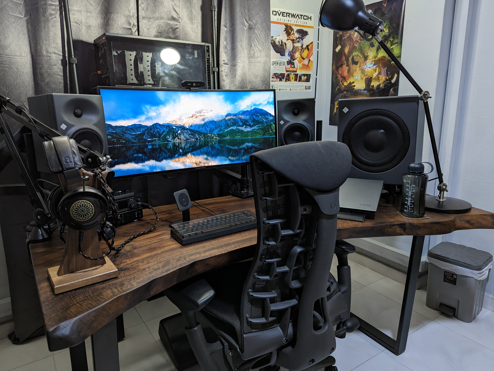{: width="1594" height="1200" }
_My Desk Setup in 2024_

## Introduction

I have always been an avid enthusiast of technology. I had originally come into the habit through the pursuit of gaming hardware, building out my own custom PCs, and building a simple desk setup that would allow me to game for hours on end. Over the years, this love for technology has evolved to encompass audio equipment and productivity as well.

The end goal has always remained the same: to have a place where I can enjoy myself ergonomically, functionally, aesthetically, regardless of what I was doing. So let me take you through a story of how I curated the desk setup that I have today, over the course of five years.

## Equipment Overview

All equipment listed here is present somewhere in the desk setup, though some items may not be visible in the photo.

### Furniture

| ‎ | Name | Description |
| --- | --- | --- |
| Desk | Bespoke American Claro Walnut Desk | 1730mm L x 620-1040mm W x 750mm H |
| Chair | Herman Miller Embody | Rhythm Black |
| Footrest | Herman Miller Leather Foot Pillow | |

### Desk Accessories

| ‎ | Name | Description |
| --- | --- | --- |
| Monitor | Acer Predator X34 GS | 34" 3440x1440 180Hz |
| Monitor Arm | AmazonBasics Premium | Single |
| Keyboard | Leopold FC660C | Black, Low Noise, Topre 45g |
| Keyboard Cover | Garbage Collection FC660C Roof | Smoke Black |
| Mouse | Razer Viper Ultimate | |
| Wireless Charger | Mophie Snap+ | 15W, MagSafe |
| USB Charger | Satechi 108W Pro | 2x USB-C, 2x USB-A |
| Power Strip | Brennenstuhl 3m 12 Socket | Type G, 230V | 

### Computer Hardware

##### Laptop

| ‎ | Name | Description |
| --- | --- | --- |
| Laptop | Lenovo Yoga Slim 7 Pro 14ACH5 O | Ryzen 7 5800H, 16GB RAM, 1TB SSD |
| Laptop Stand | Moft Z | |

##### Desktop

| ‎ | Name | Description |
| --- | --- | --- |
| CPU | Ryzen 9 5900X | 12C, 24T |
| CPU Cooler | Noctua NH-D15 | chromax.black |
| Motherboard | Asus ROG Strix X470-F | |
| Memory | T-Force Team Dark Pro 16GB | (2x8GB) 3200 Mhz CL14 |
| GPU | Powercolor RX 5700 XT Red Devil | |
| Storage 1 | Samsung 990 Pro | 2TB |
| Storage 2 | Samsung 860 EVO M.2 | 1TB |
| PSU | EVGA Supernova 650 G(1)+ | 80+ Gold |
| Case | Fractal Design Define R6 USB-C | |

### Conferencing Equipment

| ‎ | Name | Description |
| Microphone | Electro-Voice RE20 | Black |
| Microphone Arm | Rode PSA1 | |
| Microphone Shock Mount | Electro-Voice 309A | |
| Webcam | Logitech Brio | |
| Audio Interface | Motu M4 | |
| Desk Lamp | Ikea Arod | Anthracite |
| Lighting | Godox ES45 | 1%, 5500K |

### Personal Audio

| ‎ | Name | Description |
| --- | --- | --- |
| Headphones | ZMF Auteur | African Blackwood, Universe Perforated Suede, Co-Pilot Pad |
| Headphone Stand | ZMF Salire | Walnut |
| Headphone Cable | Norne Audio Silvergarde S4 | 4c, 1.5m, mXLR to XLR4 |
| Speaker Audio Interface | RME ADI-2 DAC FS | AKM AK4493 |
| Speakers | Neumann KH120 A | |
| Speaker Mounting | Ergotron LX | With Neumann LH64 VESA Adapter |
| Subwoofer | Neumann KH750 DSP | |
| IEM | Vision Ears VE8 | CIEM |
| DAP | iBasso DX160 | Blue, 2019 |

## Why I Bought It

*Gee, that's a lot of gear! How are you going to talk about all of them? I don't think I can read all of that!*

I understand that it may be overwhelming to see so many items listed out at once, some of them outside the realm of what most people would consider necessary for a desk setup. Let's tell a story about the important pieces, and how the rest filled in the gaps.

### 2019: The Baseline

#### ZMF Auteur

As the year started, I came in with a relatively spartan setup with just my (at the time) new desktop. I had just discovered an expensive hobby in audio, and I was looking to upgrade my experience. I experimented with some gear before, but this was the year I fell into the high-end, ending the year with a pair of [ZMF Auteur][1] headphones, matched with equally great supporting gear.

The African Blackwood of the Auteur was a limited edition piece, and though it appeared completely dull in poor light, it shone like a halo in bright light. This is not an audio blog, so I won't be describing the sound. I will say, though, that it remains as great as the day I bought it, and I have no plans to replace it.

{: width="1594" height="1200" }
_ZMF Auteur_

#### Vision Ears VE8

I had also wanted a great portable setup, and the [Vision Ears VE8][2] in a custom in-ear monitor (CIEM) form factor was the perfect choice. From the day I first listened to it, I had set it as my endgame in both sound and comfort. The custom fit was, and still is, perfect and comfortable for long listening sessions. Enlightening others to the possibilities of a bespoke product made just for you remains a joy to this day.

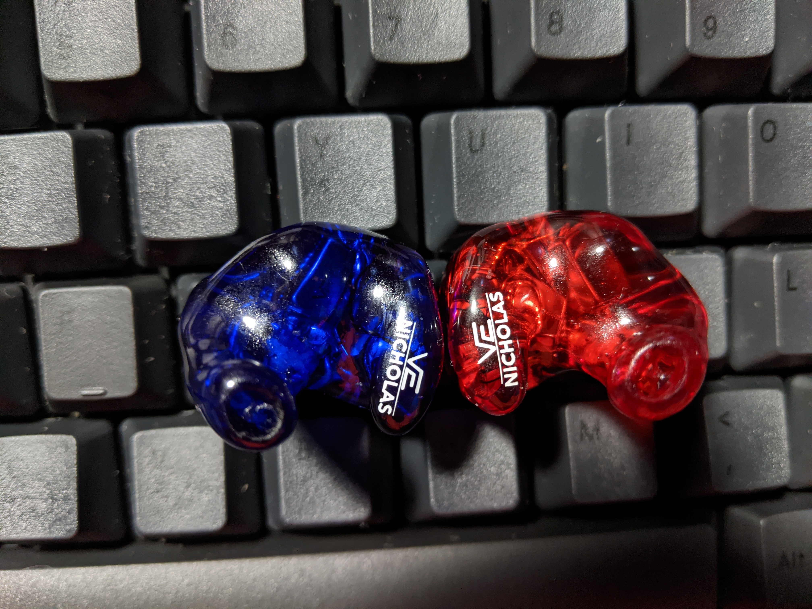{: width="1594" height="1200" }
_Vision Ears VE8_

### 2020: The Upheaval of Work

#### Leopold FC660C

As we all know, 2020 was the year a pandemic struck the world on an unprecedented scale. Even from January, I had already mobilized to have my desk setup upgraded, regardless of the circumstances. The first order of business was my keyboard, which I had desired to upgrade for a while. I was extremely curious about Topre switches, and the (then) newly introduced low-noise variant gave me an excuse to try it out. I had also wanted to try a smaller form factor, and the confluence of these two desires led me to purchase the [Leopold FC660C][3].

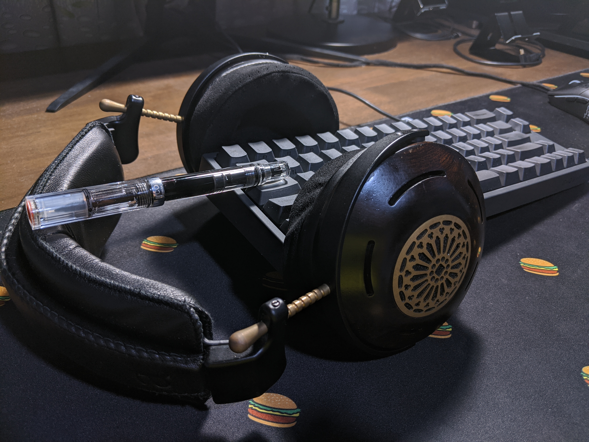{: width="1594" height="1200" }
_Leopold FC660C_

#### Herman Miller Embody

In March, I pulled the trigger on a [Herman Miller Embody][4] chair. I had already forseen that the demand for work-from-home essentials would skyrocket, and chairs were no exception. I had already gotten very comfortable with the chair in a showroom, and I was absolutely pulled in by the design, comfort, and the 12-year warranty. This had to be my throne, and it demanded that I do better with matching furniture.

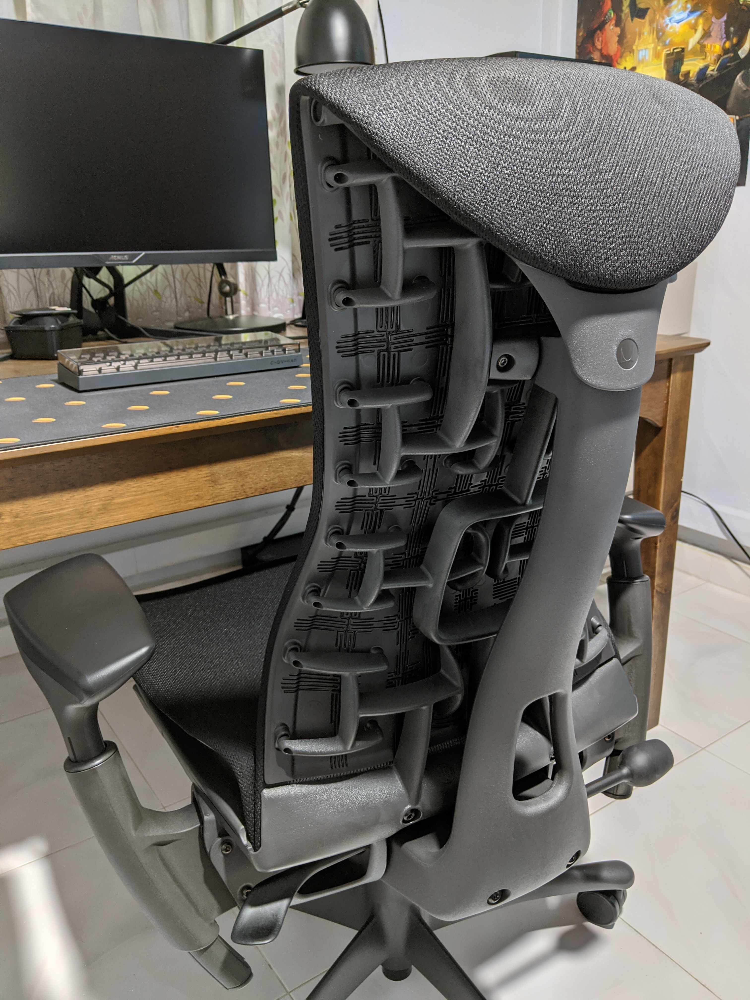{: width="1594" height="1200" }
_Herman Miller Embody_

#### Neumann KH120 A

Before the year would end, I had the chance to sneak in one more audio purchase. The [Neumann KH120 A][5] were speakers that I had identified as my next purchase, as I wanted a different audio experience from headphones. This solidified my direction to move towards equipment that were more professional in nature, rather than consumer or enthusiast grade equipment.

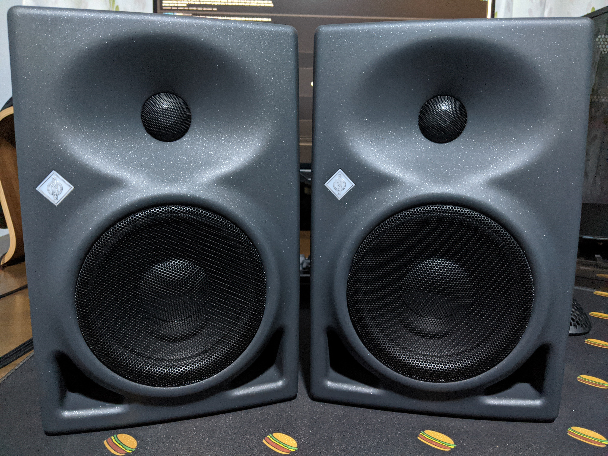{: width="1594" height="1200" }
_Neumann KH120 A_

### 2021: Centre of Attention

#### Live Edge Slab Desk

I had had a distinct realization that my gear was already pretty much either black or wooden in nature. To match the aesthetic, I decided that this would be the right time to finally get a new desk. Though I was already using a large kitchen table with a pretty dark wood, I saw the aprons on the sides as an obstacle to eventually mounting monitor arms. Beyond that, I always felt that it was not enough for my Embody to be the centerpiece of my setup, and something even more majestic should take its place.

A live edge desk was the perfect choice. I had been going to furniture showrooms to search for the perfect slab of wood, and I had found it in a store called [Grey and Sanders][6], in the form of an American Claro Walnut slab. I opted for a single uninterrupted slab, the most expensive option, as this was a statement piece that I did not want to compromise on. The grain was absolutely stunning, and the live edge was the perfect differentiator from a standard desk that would highlight it as the bespoke piece built to my preferences.

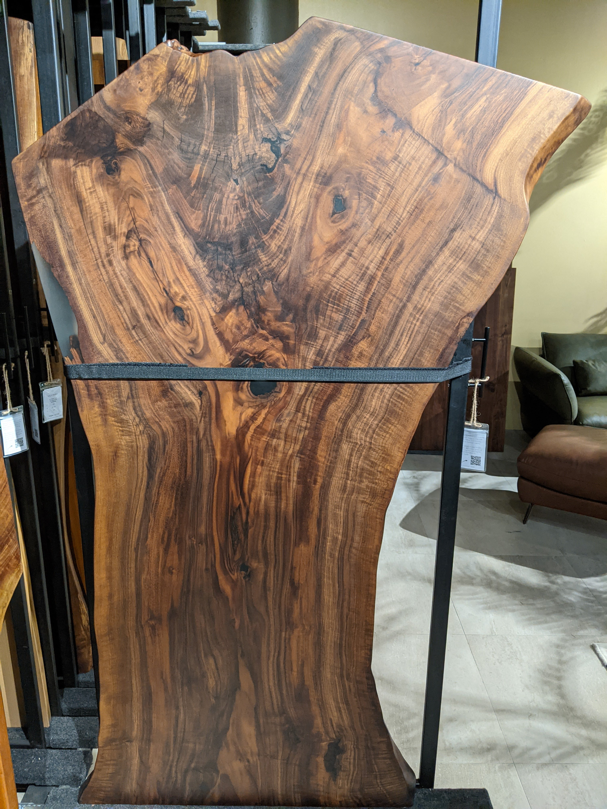{: width="1200" height="1594" }
_Live Edge Slab Desk_

#### Acer Predator X34 GS

I had always wanted to upgrade to an ultrawide, although at the time, it was an impossibility to find one that had both a high refresh rate as well as full-featured USB-C connectivity (meaning it could both charge and display video). The [Acer Predator X34 GS][7] was just one of two choices at the time (the other being the LG 34GP83A-B), and I went for the Acer as it was the only one available in Singapore. I finally had the centerpiece for the desk that would be my focal point, and supported my two-system workflow easily.

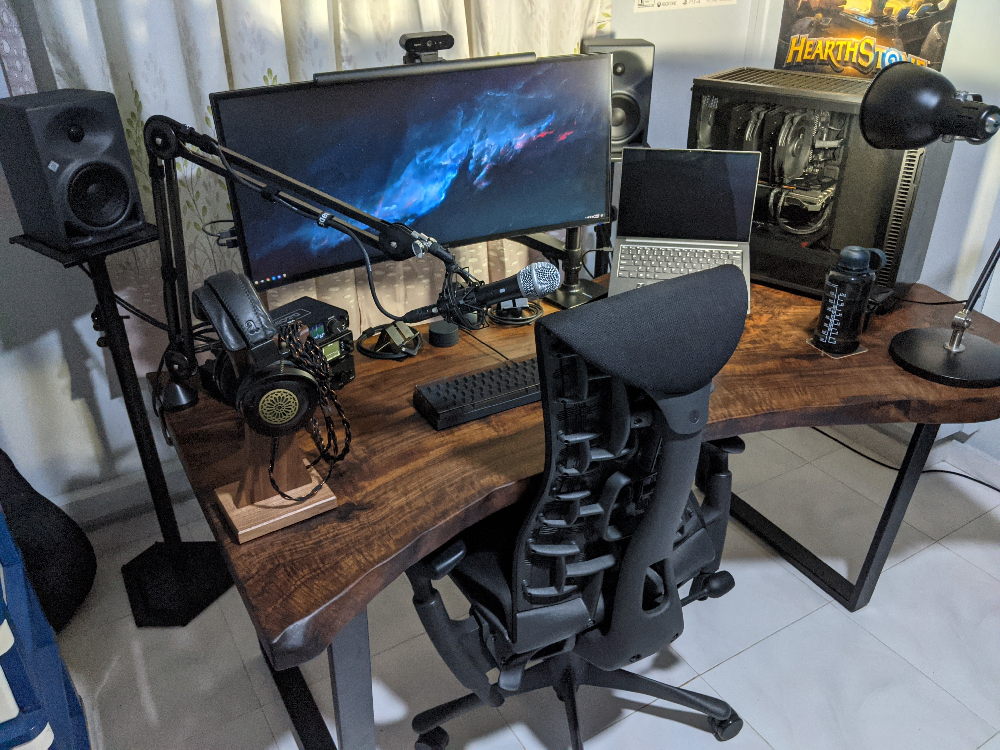{: width="1594" height="1200" }
_Acer Predator X34 GS_

#### Lenovo Yoga Slim 7 Pro

This was also the year I got accepted into my university, and the next step was to get a laptop that would be able to handle the workload. The [Lenovo Yoga Slim 7 Pro][8] was the perfect choice, as it had a Ryzen 7 5800H, 16GB of RAM, and a 1TB SSD. It was also one of the few laptops (at the time) that had an OLED display, which was something I liked for its contrast, since I use dark mode wherever possible. It was also lightweight at 1.4kg, which was a priority as I would be carrying it around campus.

{: width="1594" height="1200" }
_Lenovo Yoga Slim 7 Pro_

### 2022: Conference Ready

#### Herman Miller Leather Foot Pillow

Something seemed to be missing from my otherwise great ergonomic setup. I came to realize that this was a footrest, as I realized my feet would not be touching the ground when I was leaning back. The [Herman Miller Leather Foot Pillow][9] was the perfect answer, as it now allowed me to lean back comfortably and matched the Embody perfectly.

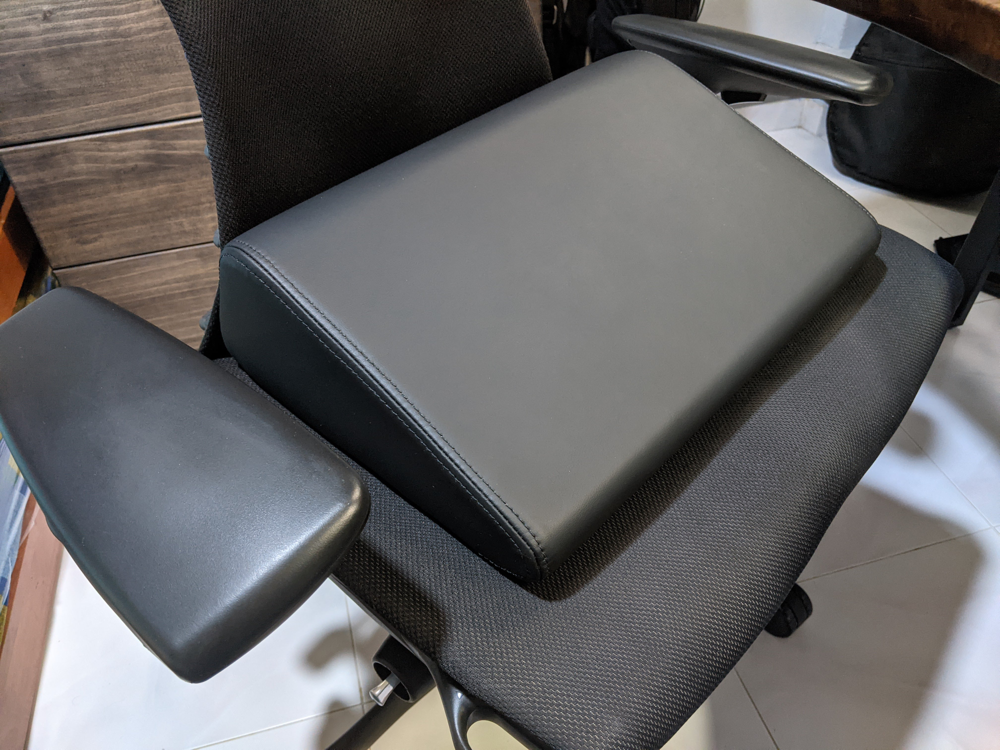{: width="1594" height="1200" }
_Herman Miller Leather Foot Pillow_

#### Electro-Voice RE20

I believed that my conferencing setup was already great, but what would take it to the next level was a better microphone. The [Electro-Voice RE20][10] was the perfect choice, as it was a broadcast standard microphone that suited my voice well. The competing Shure SM7B would have made my voice too boomy, and would have also required supporting equipment and EQ. With the RE20, I could plug it directly into my Motu M4 and get great sound quality without any additional equipment.

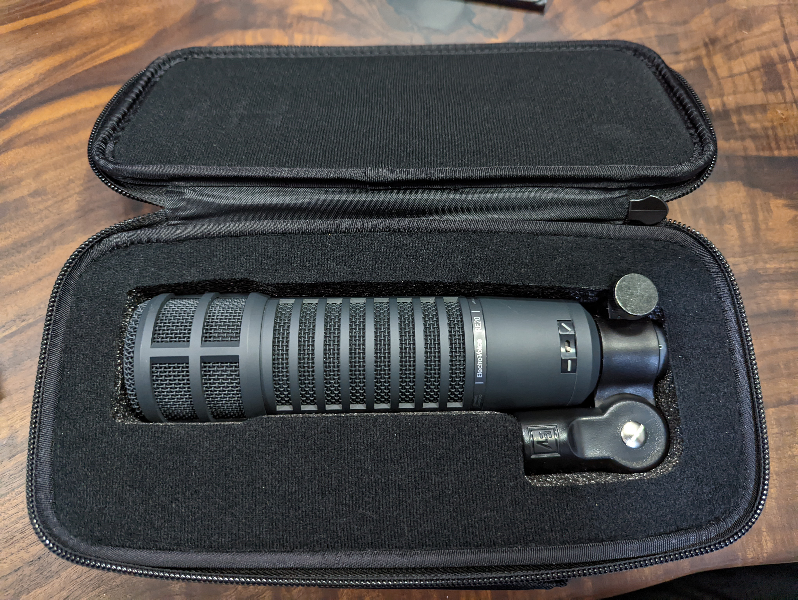{: width="1594" height="1200" }
_Electro-Voice RE20_

#### Godox ES45

The final piece of the puzzle was lighting. I had always felt that my setup had too inconsistent and uneven lighting, and this would give off an unpolished look in video calls. The [Godox ES45][11] was the right choice, as it was a large panel light that did not require Wi-Fi, unlike its competitor, the Elgato Key Light. It also helped that it came with its own remote, which allowed an app-free management experience.

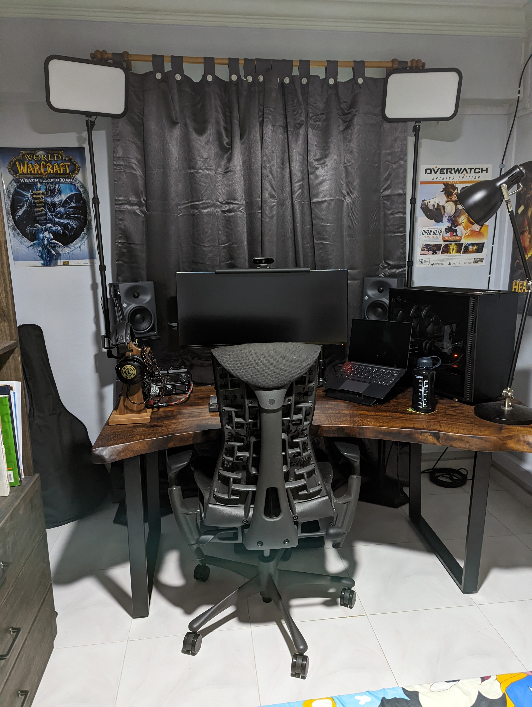{: width="1200" height="1594" }
_Godox ES45_

### 2023: The Final Touches

#### Neumann KH750 DSP

I believed it was long overdue to get the matching subwoofer for my Neumann KH120 A speakers, the [Neumann KH750 DSP][12]. It was to be expected that the low end could be improved, and the DSP features of the subwoofer allowed me to tune it to my room's acoustics. With the subwoofer, I could now finally enjoy a more immersive audio experience, with bass that slammed you when it was called for.

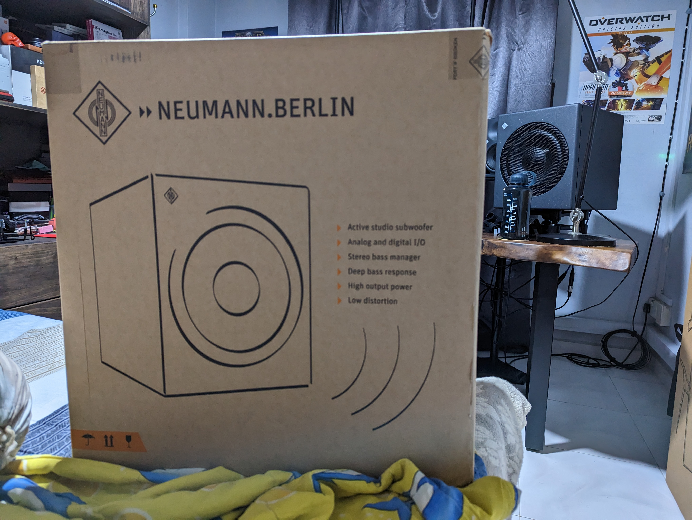{: width="1594" height="1200" }
_Neumann KH750DSP_

## Conclusion

And now, it was all complete. The vision I had for my desk setup finally took shape, one piece of the puzzle at a time. It was a journey that took me through the highs and lows of the past five years, and every new piece of gear reflected my growth as a person, and my changing needs and desires. I had finally reached a point where I could say that I was satisfied with my desk setup, and that it was a place where I could enjoy myself for hours on end, regardless of what I was doing.

The journey is not over, however. I believe there is always going to be upgrades and changes to be made, as technology and my needs evolve. But for now, this is the desk setup that I have, and I am proud to share it with you.

If you would like to see it again, you can always refer back to the [corresponding section](#desk-setup).

## What's Next?

I plan to share more about what I've done with OPNsense to replace my Asus router, and the basic setup I currently have for my home network. It will not be a review of the software or a guide on how to set it up, but more of a sharing of my experiences with it, and how it has helped me in my journey to learn more about networking and security.

```bash
nicholaschua@youread.me:~$ exit
logout
```
{: .nolineno }
{: file="nicholaschua@youread.me: ~" }

## References

1. [ZMF Auteur][1]
2. [Vision Ears VE8][2]
3. [Leopold FC660C][3]
4. [Herman Miller Embody][4]
5. [Neumann KH120 A][5]
6. [Grey and Sanders Wood Slabs][6]
7. [Acer Predator X34 GS][7]
8. [Lenovo Yoga Slim 7 Pro][8]
9. [Herman Miller Leather Foot Pillow][9]
10. [Electro-Voice RE20][9]
11. [Godox ES45][10]
12. [Neumann KH750DSP][11]

[1]: https://www.zmfheadphones.com/auteur-eikon
[2]: https://vision-ears.de/product/ve-8
[3]: https://deskthority.net/wiki/Leopold_FC660C
[4]: https://www.hermanmiller.com/products/seating/office-chairs/embody-chairs/
[5]: https://www.neumann.com/en-us/products/historical/kh-120-a-g/
[6]: https://greyandsanders.com/collections-wood-slabs.html
[7]: https://www.acer.com/sg-en/predator/monitors/x34/pdp/UM.CX0SG.S01
[8]: https://psref.lenovo.com/Detail/Yoga/Yoga_Slim_7_Pro_14ACH5_O?M=82N5000WCK
[9]: https://www.hermanmiller.com/en_lac/products/accessories/desk-accessories/foot-pillow/
[10]: https://www.electrovoice.com/product.php?id=91
[11]: https://www.godox.com/product-d/ES45-20.html
[12]: https://www.neumann.com/en-us/products/monitors/kh-750-dsp/

---
[Return to Index](#desk-setup-2024)