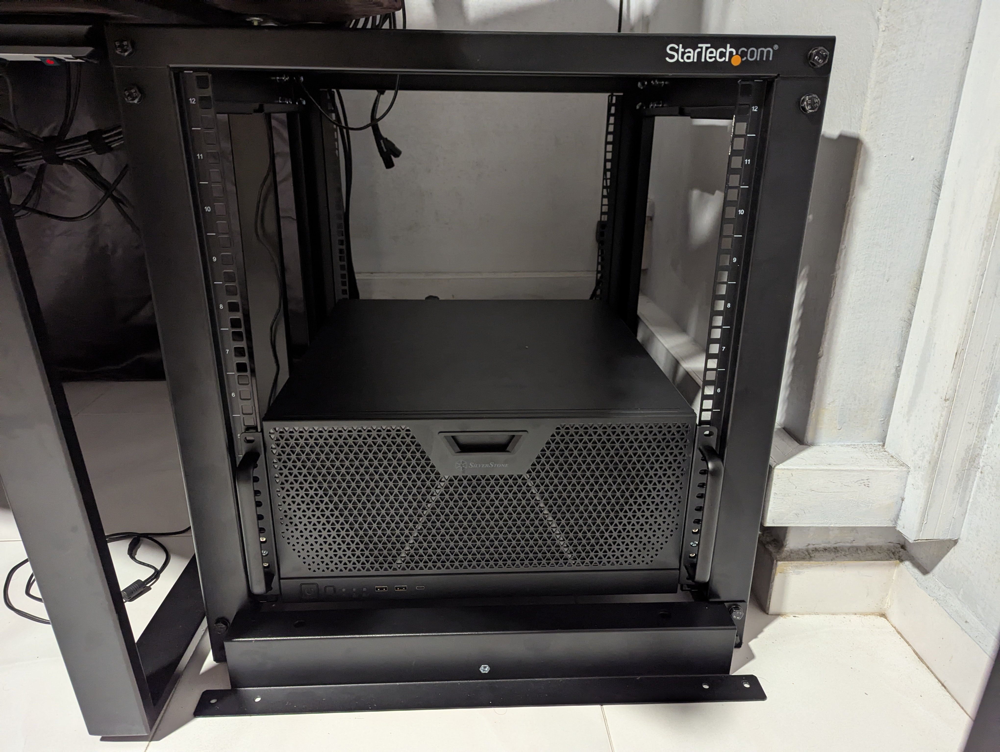

# Rackmount Beginnings

## Disclaimer

As made clear in my [About]() page, I do not do affiliate marketing or advertising. All products reviewed are purchased by me and all opinions are my own. I hate to see biased reviews as much as you do.

## Introduction

In my previous post, I documented my [new PC build for 2025](). I had been entertaining the idea of a rackmount setup for a few years, and I finally decided to go ahead with it. In this post, I will document the beginnings of my rackmount setup, including the parts I selected and the assembly process.

## The Rack

I decided to go with the [Startech 12U Open Frame Rack][1]. I chose this rack over other competitors because of the reliable experience I had with Startech products in the past, and the open frame design allowing me to easily access components. The rack is well-built and sturdy, and although I did not use the wheels or self-levelling feet, as it would have made the rack too tall to fit, it is still relatively easy to move around.

## The Assembly

Assembling the rack was straightforward, and the full color manual provided gave good instructions. While I built the rack with a friend, I believe it might be significantly harder to do it alone, as some of the assembly requires multiple pieces to be held in place while the screws are tightened. I would recommend having a second person to help with the assembly.

## Rackmounting the PC

Rackmounting the PC was relatively simple and doable alone. I used the [Silverstone SST-RMS05-22 Rail Kit][2] to mount the PC in the rack. The rail kit is well designed and easily mounted onto the rack, working in two parts. The first part is mounted to the rack, and the second part is mounted to the case. The rail kit allows for easy sliding in and out of the PC, which is a standard in enterprise racks. The rail kit is also adjustable in depth, suitable for different depths of racks. It was also tool-less, which made it easy to install.

One key thing to note was to mount the rails to the second unit of the rack height instead of the first unit, as the rail mounting sat slightly below the middle part of the sides of the case. This was not mentioned in the manual, but I found it out after some trial and error. This meant I mounted the rails to the second unit of the rack, and the case occupied the first five units of the rack.

After separating the two parts of the rail kit, mounting the first part to the rack, and the second part to the case, I slid the case into the rack with little effort, applying some pressure to the locking mechanism to temporarily unlock it, then sliding the case in and allowing the mechanism to relock. This then allows one to easily slide the case in and out of the rack, allowing easy access for maintenance.

## The Rackmount Setup

This is what the rackmount setup looks like after the assembly, with the new PC in place.

{: width="1594" height="1200" }
_Rackmounted_

## The Future

With a server rack now in place, buying decisions for the next few years will now prioritize rackmountable components. I am looking to add components such as network switches and audio interfaces to the rack in the future. I may also consider finding a way to mount my old PC build in the rack, as a dedicated homelab server that runs 24/7. If I still have space left, an Uninterruptible Power Supply (UPS) may also be added to the rack, adding peace of mind in case of power outages.

## Conclusion

With the rackmount setup finally completed, I am looking forward to the next steps in my homelab journey. The rack will serve as a good platform for expansion in the future, and I am excited to see how it will evolve over the next few years. While this is just the beginning, I am already pleased with the results and I look forward to sharing more updates in the future.

```bash
nicholaschua@youread.me:~$ exit
logout
```
{: .nolineno }
{: file="nicholaschua@youread.me: ~" }

## References

1. [Startech 12U Open Frame Rack][1]
2. [Silverstone SST-RMS05-22 Rail Kit][2]

[1]: https://www.startech.com/en-sg/server-management/4postrack12u
[2]: https://www.silverstonetek.com/en/product/info/server-nas/RMS05-22/

---
[Return to Top](#rackmount-beginnings)
